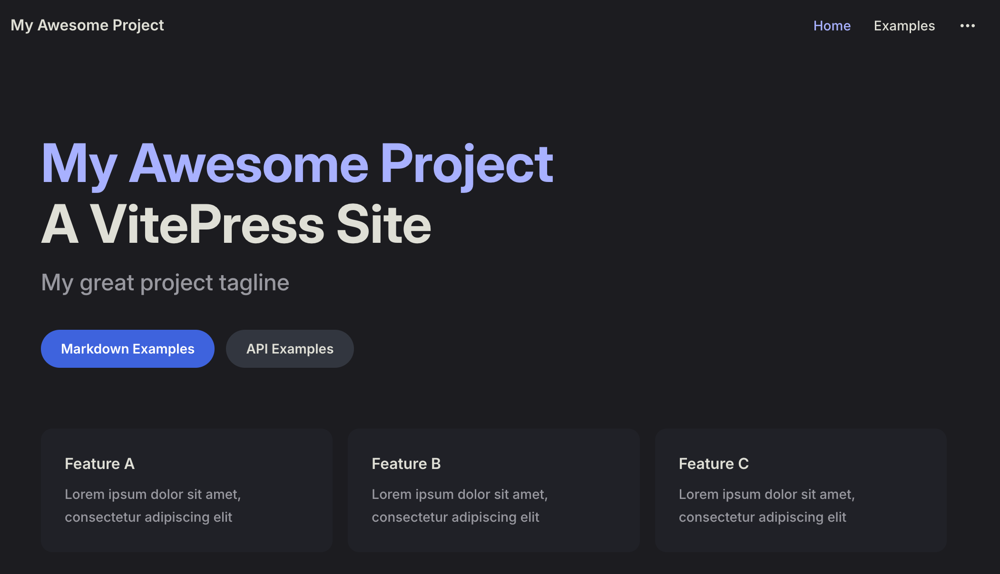

## 1. 基本流程

```bash
# 安装 vitepress
$ pnpm add -D vitepress

# 完成初始化
$ pnpm vitepress init

# 按照提示完成初始化配置：
# ┌  Welcome to VitePress!
# │
# ◇  Where should VitePress initialize the config?
# │  ./docs
# │
# ◇  Site title:
# │  My Awesome Project
# │
# ◇  Site description:
# │  A VitePress Site
# │
# ◇  Theme:
# │  Default Theme
# │
# ◇  Use TypeScript for config and theme files?
# │  Yes
# │
# ◇  Add VitePress npm scripts to package.json?
# │  Yes
# │
# └  Done! Now run pnpm run docs:dev and start writing.

# 启动 vitepress
$ pnpm docs:dev

# 在浏览器中打开 Local 预览效果。
# vitepress v1.6.3
# ➜  Local:   http://localhost:5173/
# ➜  Network: use --host to expose
# ➜  press h to show help
```


